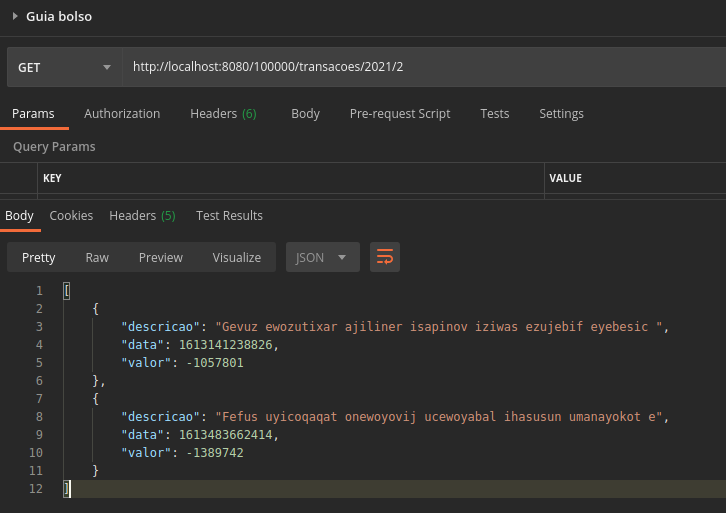

# Guiabolso, mock api

[](https://sonarcloud.io/dashboard?id=FelipeNathan_Guiabolso)
[](https://github.com/FelipeNathan/Guiabolso/actions/workflows/ci.yml)

## Requirements
- Kotlin
- Gradle
- JDK 1.8+

## Objective
- Create a mock api running over http requests, the api must return a JSON response with the following interface

```json
[GET] /<id>/transacoes/<ano>/<mes>

Content-type: application/json

[
  {
     "descricao": "string(10, 120)"
     "data": "long(timestamp)"
     "valor": "integer(-9.999.999, 9.999.999)"
  }  
]
```

## Usage
- Run the project on your preferred IDE or build the project
  ```bash
  $ ./gradlew build
  $ java -jar build/libs/guiabolso-0.0.1-SNAPSHOT.jar
  ```
- The server will start on localhost on port 8080 by default
- Call the endpoint (I used Postman)


